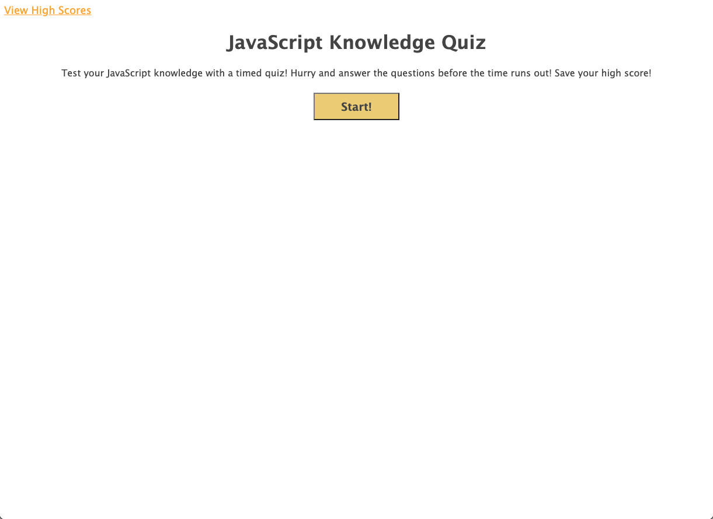

  # Knowledge Quiz
  

  ## Description
  Test your JavaScript knowledge with a timed quiz. Correct questions add 5 to your time/score, incorrect questions subtract 5 from your time/score. Save your highscores to keep track of progess. Clear your highscores to start from scratch.

  ## Table of Contents
  * [Installation](#installation-instructions)
  * [Usage](#usage)
  * [Contributing](#contributing)
  * [Tests](#tests)
  * [Questions](#questions)
  
  
  

  ## Installation Instructions
  No installation is required. Navigate to: [harvbcoding.github.io/knowledge-quiz](https://harvbcoding.github.io/knowledge-quiz/)

  ## Usage
  Once on the home page click the start button to start the timer. The quiz is over when time runs out or when all questions are answered. Users will then enter their initials to save their high score.

  
  ## Contributing
  I appreciate your interest in improving this project, however I am not accepting contributions at this time.
  

  
  ## Tests
  Examples of website functionality: 
  
  
  

  ## Questions
  If you have any questions or need to report bugs please reach out to me at [HarvBCoding](https://www.github.com/HarvBCoding) or harvey.breania@gmail.com
  
  

